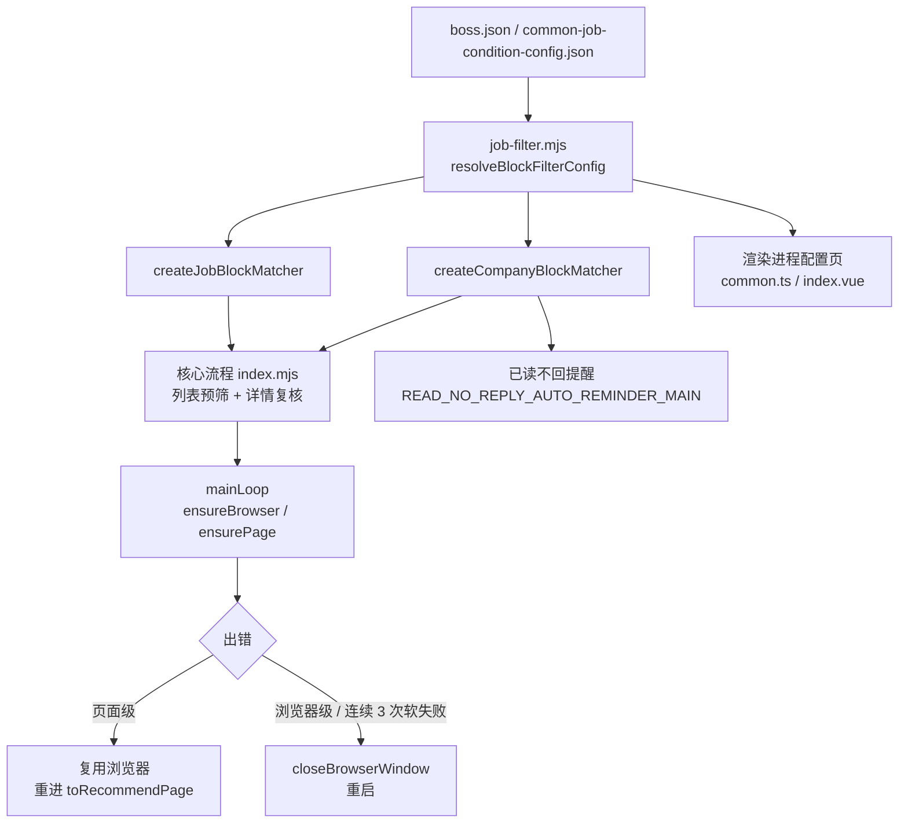
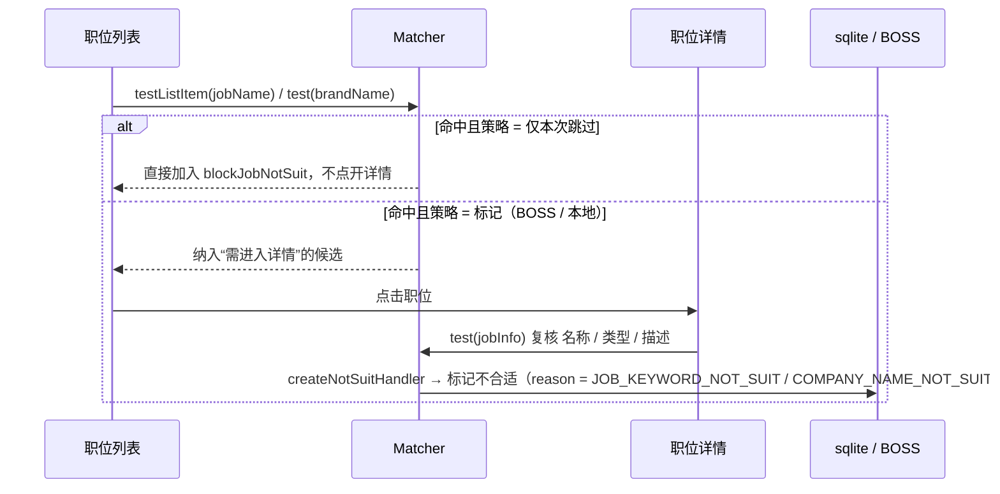

# GeekGeekRun 升级改造计划（2026-09）

> 状态标记：✅ 已完成 · 🔄 进行中 · ⏳ 待办
>
> 本文档是本轮改造的唯一“方案落盘”，所有代码改动均以此为依据；后续维护请同步更新本文件。
>
> **2026-09-18 复核轮次**：对第 1–7 节的实现逐处审计，修复 4 个真实缺陷（见第 9 节）、落地第 8 节两项增强，
> 并补上此前只有口头结论、没有落盘的验证（`pnpm test`，共 70 个断言）。

## 0. 目标

| # | 需求 | 结果 |
|---|------|------|
| 1 | **岗位关键词检测与过滤**：识别岗位（名称 / 类型 / 描述）中的特定字段，投递环节自动跳过 | 新增 `blockJobKeywordList` 等 3 个配置项；列表阶段预筛 + 详情阶段复核 |
| 2 | **公司级过滤去正则化**：忽略带特定字段的公司，用直观的关键词列表替代正则 | 新增 `blockCompanyKeywordList`；旧正则自动迁移 / 兼容兜底 |
| 3 | **浏览器打开 / 关闭逻辑优化**：避免频繁关闭再重开 | 复用已连接的浏览器与页面；按错误类型区分“重进流程”与“重启浏览器” |
| 4 | **实现方式人性化**：配置、调用、维护更友好 | 抽出纯函数模块 `job-filter.mjs` 三端共用；统一配置解析；收敛重复代码；命令行入口可直接运行 |

## 1. 总体架构



核心原则：

- **一处定义、三端共用**：匹配规则只写在 `packages/geek-auto-start-chat-with-boss/job-filter.mjs`（无 puppeteer、无文件 IO），核心流程、Electron 主进程、渲染进程都从这里导入，保证“什么算命中”三端一致。
- **关键词优先、正则兜底**：用户只需填“逗号分隔的关键词”。旧版正则若为 `a|b|c` 形式自动转换；无法安全转换的正则在关键词为空时仍生效，不破坏老用户。
- **能不重启就不重启**：浏览器进程是最重的资源，只有 CDP 会话真的断开或连续软恢复失败时才重启。

## 2. 配置结构

### 2.1 新增字段（`boss.json` 与 `common-job-condition-config.json` 均可出现）

| 字段 | 类型 | 说明 |
|------|------|------|
| `blockCompanyKeywordList` | `string[]` | 公司名称包含任一关键词（忽略大小写 / 空白）即屏蔽 |
| `blockCompanyKeywordExcludeList` | `string[]` | 公司名称命中排除词时**放行**（与上一个字段成对使用，用于消解误伤） |
| `blockJobKeywordList` | `string[]` | 职位信息包含任一关键词即屏蔽 |
| `blockJobKeywordExcludeList` | `string[]` | 职位信息命中排除词时**放行**（与上一个字段成对使用） |
| `blockJobKeywordMatchFields` | `('jobName'\|'jobType'\|'jobDesc')[]` | 职位关键词匹配范围，默认三项全选 |

### 2.2 仅 `boss.json`（属于“本次运行策略”）

| 字段 | 类型 | 说明 |
|------|------|------|
| `blockCompanyNameRegMatchStrategy` | `MarkAsNotSuitOp` | 公司命中后的处理（沿用旧键名，避免破坏配置） |
| `blockJobKeywordMatchStrategy` | `MarkAsNotSuitOp` | 职位命中后的处理，默认 `NO_OP`（仅本次运行跳过） |
| `fieldsForUseCommonConfig.blockCompanyNameRegExpStr` | `boolean` | 公司屏蔽使用公共配置（沿用旧键名） |
| `fieldsForUseCommonConfig.blockJobKeyword` | `boolean` | 职位屏蔽使用公共配置 |

### 2.3 兼容 / 迁移

- `runtime-file-utils.mjs#migrateLegacyBlockCompanyRegExpToKeywordList`：在 `ensureConfigFileExist()` 中幂等执行。若配置缺少 `blockCompanyKeywordList`：
  - 旧正则可转换 → 写入关键词数组并清空 `blockCompanyNameRegExpStr`；
  - 不可转换 → 写入 `[]`，正则原样保留，运行时由 `createCompanyBlockMatcher` 兜底。
- UI 保存时若 payload 含 `blockCompanyKeywordList`，同时把 `blockCompanyNameRegExpStr` 置空，避免两套规则同时生效。
- 新增枚举 `MarkAsNotSuitReason.JOB_KEYWORD_NOT_SUIT = 8`，入库记录可区分“职位关键词命中”。

## 3. 运行时匹配流程



- 列表阶段能拿到 `jobName` 与 `brandName`，因此“仅本次跳过”策略下命中职位无需点开详情，速度最快、操作最少。
- 详情阶段可拿到 `positionName`（职位类型）与 `postDescription`（描述），做完整复核。
- 所有命中都会打印结构化日志：`[屏蔽职位] 《xxx》（公司）职位描述命中关键词“外包”`，便于排查误伤。

## 4. 浏览器生命周期

| 场景 | 旧行为 | 新行为 |
|------|--------|--------|
| 选择器等待超时、页面结构变化等页面级异常 | 关浏览器 → 5s → 重开 → 重设 Cookie | 保留浏览器和页面，5s 后重进 `toRecommendPage` |
| 当日开聊次数用尽（睡 60min 后抛错） | 重启浏览器 | 复用浏览器重进流程 |
| `Target closed` / `Session closed` / `Protocol error` / 浏览器进程被关 | 重启 | 重启（`isBrowserLevelError` 或 `browser.connected === false`） |
| 连续 3 次软恢复仍失败 | — | 升级为重启浏览器，防止卡死在怪异页面状态 |
| 页面正常加载（`pageLoaded`） | — | 重置软恢复计数 |

实现要点（`index.mjs`）：

- `ensureBrowser()` / `ensurePage()`：已连接就复用；页面被关掉则复用其他已开页面或 `newPage()`。
- 只在**新启动**浏览器时从文件恢复 Cookie / localStorage；复用时以浏览器内实时会话为准，不用旧文件覆盖。
- `browser.once('disconnected')` 自动清空引用。
- 重进 `toRecommendPage` 时 `removeAllListeners('request' | 'response')`，清理上一轮遗留监听器。
- `closeBrowserWindow()` 变为 `async`，`close()` 5s 超时兜底后再 `kill` 进程。
- 对外导出 `isBrowserAlive` / `isBrowserLevelError` / `decideRecoveryAction`，由 run-core 与 UI worker 两个调用方统一决策。

## 5. 逐文件改动清单

### 5.1 核心包 `packages/geek-auto-start-chat-with-boss`

| 文件 | 状态 | 改动 |
|------|------|------|
| `job-filter.mjs` | ✅ 新增 | 纯函数：`normalizeKeywordList` / `keywordListToText` / `convertLegacyRegExpStrToKeywordList` / `findMatchedKeyword` / `createCompanyBlockMatcher` / `createJobBlockMatcher` / `resolveBlockFilterConfig` / `JOB_KEYWORD_MATCH_FIELDS`；两个 matcher 均支持 `excludeKeywordList`（排除词优先，同字段内消解） |
| `index.mjs` | ✅ | 移除正则；接入两个 matcher；列表预筛；`getTempTargetJobIndexToCheckDetail` 加关键词条件；6 段重复的“标记不合适”处理器收敛为 `createNotSuitHandler` 工厂并新增 `jobKeyword`；`mainLoop` 拆为 `ensureBrowser / ensurePage / restoreLoginSession`；`mainFlowWillLaunch` 透传全部策略；JSON 导入改为 `with { type: 'json' }`；**复核轮**：列表预筛三条件拆开、命中/放行日志、恢复决策抽出 `resolveRecoveryAction` |
| `runtime-file-utils.mjs` | ✅ | 旧正则 → 关键词一次性迁移；JSON 导入语法升级 |
| `default-config-file/boss.json` | ✅ | 新增 6 个默认字段 |
| `default-config-file/common-job-condition-config.json` | ✅ | 新增 3 个默认字段 |

### 5.2 `packages/sqlite-plugin`

| 文件 | 状态 | 改动 |
|------|------|------|
| `src/enums.ts` | ✅ | `MarkAsNotSuitReason.JOB_KEYWORD_NOT_SUIT = 8`；**复核轮**：新增 `MARK_AS_NOT_SUIT_REASON_TEXT_MAP` + `getMarkAsNotSuitReasonText()` |
| `src/index.ts` | ✅ | `mainFlowWillLaunch` 用“策略 → 原因”表加载最近 7 天本地标记（补齐工作经验 / 薪资 / 公司 / 职位关键词）；**复核轮**：修掉恒为 false 的外层门禁（详见 9.1） |
| `dist/` | ✅ 已重新构建 | `npx tsc --outDir dist`（存在 2 处**改造前已有**的 TS 报错，不影响产物） |

### 5.3 `packages/run-core-of-geek-auto-start-chat-with-boss`（命令行入口）

| 文件 | 状态 | 改动 |
|------|------|------|
| `main.mjs` | ✅ | 用 `decideRecoveryAction` 决策复用 / 重启；补齐 `jobDetailIsGetFromRecommendList` / `jobMarkedAsNotSuit` 钩子；自动读取 `~/.geekgeekrun/storage/last-used-browser-record` 作为浏览器路径 |
| `daemon-main.mjs` | ✅ | 用 `process.execPath --import register-hooks.mjs` 拉起子进程 |
| `register-hooks.mjs` / `resolve-hooks.mjs` | ✅ 新增 | ESM 解析钩子，补全核心包里为 vite 而写的无扩展名导入 |
| `package.json` | ✅ | `start:bare` 加 `--import` |

### 5.4 Electron 主进程 `packages/ui/src/main`

| 文件 | 状态 | 改动 |
|------|------|------|
| `flow/GEEK_AUTO_START_CHAT_WITH_BOSS_MAIN/index.ts` | ✅ | 同 run-core：复用 / 重启决策 |
| `flow/READ_NO_REPLY_AUTO_REMINDER_MAIN/index.ts` | ✅ | 用 `createCompanyBlockMatcher` 替代正则（排除词自动生效） |
| `flow/OPEN_SETTING_WINDOW/ipc/index.ts` | ✅ | 保存 4 个新字段（复核轮补齐 2 个排除词字段）；保存关键词时清空旧正则 |
| `window/commonJobConditionConfigWindow.ts` | ✅ | 公共配置保存时归一化关键词（含排除词）、清空旧正则 |

### 5.5 渲染进程 `packages/ui/src/renderer`

| 文件 | 状态 | 改动 |
|------|------|------|
| `page/MainLayout/GeekAutoStartChatWithBoss/common.ts` | ✅ | 关键词模板（公司 / 职位）、读取 / 序列化 helper（含排除词）、`getRuleOfBlockKeywordText`（拒绝 <2 字符关键词，排除词文案区分“误放行”）；删除正则模板与校验 |
| `page/MainLayout/GeekAutoStartChatWithBoss/index.vue` | ✅ | “不期望投递公司正则”区块 → 关键词；新增“不期望投递职位关键词”区块（匹配范围 + 策略 + 公共配置开关）；**复核轮**：两块各加排除词输入框与校验；保存统一走 `buildConfigPayloadFromForm()` |
| `page/CommonJobConditionConfig/index.vue` | ✅ | 同上两个区块的公共配置版（含排除词） |
| `page/MainLayout/ReadNoReplyReminder.vue` | ✅ | 文案与展示改为关键词 |
| `page/MainLayout/MarkAsNotSuitRecord.vue` | ✅ | **复核轮**：标记原因文案改从 `sqlite-plugin` 统一取；补上 `JOB_KEYWORD_NOT_SUIT` 分支；展示 `extInfo` 里的命中关键词 / 排除词 |

### 5.6 其他

| 文件 | 状态 | 改动 |
|------|------|------|
| `packages/launch-bosszhipin-login-page-with-preload-extension/utils.mjs` | ✅ | JSON 导入语法升级为 `with` |
| `packages/geek-auto-start-chat-with-boss/job-filter.test.mjs` | ✅ 新增 | `node:test` 单元测试，52 个断言（含排除词） |
| `packages/run-core-of-geek-auto-start-chat-with-boss/main-flow-smoke.test.mjs` | ✅ 新增 | 核心模块加载 + 浏览器恢复决策冒烟测试，15 个断言 |
| `docs/UPGRADE_PLAN_2026-09.md` | ✅ | 本文件 |
| `README.md` | ✅ | 补充“不期望投递公司 / 职位关键词（含排除词）”功能说明 |
| `package.json`（根） | ✅ | 新增 `test` / `test:unit` / `test:smoke` 脚本 |

## 6. 验证

| 项目 | 状态 | 方式 / 结果 |
|------|------|-------------|
| `job-filter.mjs` 单元断言 | ✅ 通过 | `pnpm test:unit`：8 个 suite / **52 个断言全部通过**（归一化、去重、旧正则转换、大小写 / 空白忽略、字段范围、排除词、公共配置解析、端到端组合） |
| 核心模块可加载 + 恢复决策 | ✅ 通过 | `pnpm test:smoke`：15 个断言全部通过（导出齐全、`isBrowserLevelError` 分类、`resolveRecoveryAction` 升级重启边界） |
| sqlite-plugin 构建 | ✅ | `npx tsc --outDir dist`；仅剩改造前既有报错（`@types/web-bluetooth` 的 `BufferSource`、`src/index.ts:119` 的解构签名），`dist` 产物含新枚举与可读文案映射 |
| 用户配置迁移 | ✅ | `~/.geekgeekrun/config/*.json` 已自动补齐 `blockCompanyKeywordList: []` |
| UI 类型检查 | ✅ | `vue-tsc -p tsconfig.web.json`（310 处）与 `tsc -p tsconfig.node.json`（147 处）**均为改造前既有报错**，本次改动前后错误集合逐行一致（diff 为空） |
| UI 依赖 | ✅ | 本机 node_modules 已可用（`vue-tsc` / `vite` / `electron-vite` 均在 root `node_modules/.bin`），无需再装 UI 依赖即可跑类型检查 |
| 真机运行 | 🔄 | 见第 7 节；需人工在 BOSS 直聘上跑一轮确认 |

## 7. 执行（开始运行）

依赖安装说明（本机 Windows，GitHub 直连不可用）：

```bash
# 1) better-sqlite3 预编译包走 npmmirror
cd node_modules/better-sqlite3 && \
  npm_config_better_sqlite3_binary_host_mirror=https://registry.npmmirror.com/-/binary/better-sqlite3 npx prebuild-install
# 2) pnpm 8 hoisted 安装（UI 包可跳过）
corepack pnpm@8.15.9 install --filter "@geekgeekrun/run-core-of-geek-auto-start-chat-with-boss..." --filter geekgeekrun --frozen-lockfile
# 3) 构建 sqlite-plugin
cd packages/sqlite-plugin && npx tsc --outDir dist
```

启动自动开聊（复用 UI 里配置好的浏览器与 Cookie）：

```bash
pnpm start            # = node packages/run-core-of-geek-auto-start-chat-with-boss/daemon-main.mjs
```

改动后先跑测试（不需要浏览器、不需要登录态）：

```bash
pnpm test             # = test:unit + test:smoke，共 70 个断言
pnpm test:unit        # 只跑过滤器纯函数（52 个断言）
pnpm test:smoke       # 只跑核心模块加载 + 恢复决策（18 个断言）
```

可选环境变量：

- `PUPPETEER_EXECUTABLE_PATH`：覆盖浏览器路径（默认读 `~/.geekgeekrun/storage/last-used-browser-record`）
- `MAIN_BOSSGEEKGO_RERUN_INTERVAL`：出错后重进 / 重启的等待毫秒数，默认 5000

推荐先在 `~/.geekgeekrun/config/boss.json` 中填入一组关键词做验证，例如：

```json
"blockJobKeywordList": ["外包", "驻场", "销售"],
"blockJobKeywordExcludeList": ["非外包"],
"blockJobKeywordMatchFields": ["jobName", "jobType", "jobDesc"],
"blockJobKeywordMatchStrategy": 3,
"blockCompanyKeywordList": ["软通动力", "中软国际"],
"blockCompanyKeywordExcludeList": ["软通动力大学"],
"blockCompanyNameRegMatchStrategy": 3
```

运行日志中出现 `[屏蔽职位] …命中关键词“…”` / `[屏蔽职位] …被排除词“…”放行` / `[Browser] 复用已打开的浏览器，重新进入流程` 即表示新逻辑生效。

## 8. 后续增强（本轮已完成）

原计划里列为“可考虑”的两项增强，本轮已落地：

| 增强 | 状态 | 实现 |
|------|------|------|
| 关键词支持“排除词” | ✅ | 新增 `blockCompanyKeywordExcludeList` / `blockJobKeywordExcludeList`；`job-filter.mjs` 中排除词优先于屏蔽词，**在同一字段内**判断（描述里的“非外包”救不了职位名称里的“外包”），三端共用 |
| 不合适原因可读文案 | ✅ | `sqlite-plugin/src/enums.ts` 新增 `MARK_AS_NOT_SUIT_REASON_TEXT_MAP` 与 `getMarkAsNotSuitReasonText()`；`MarkAsNotSuitRecord.vue` 改为从该表取文案，并展示 `extInfo` 里记录的命中关键词 / 排除词 |

仍未做（留作后续）：

- 关键词命中时的“精准命中”与“拼接命中”不做区分（例如“前端”会命中“资深前端”），如需精确词边界匹配，需要再引入匹配模式选项。
- 排除词目前是“同字段内消解”，不支持跨字段逻辑（如“职位描述含非外包 → 放行整条职位”）。
- 旧版正则里无法转换成关键词的部分仍只在运行时兜底，UI 不再展示，属于“能跑但用户看不见”的配置。

## 9. 本轮审计修复（2026-09-18）

对第 1–7 节的实现做逐处复核时，发现并修复了 4 个真实缺陷。它们都落在“单次改动看起来正确、组合起来出错”的边界上，因此同时补了对应测试。

### 9.1 `sqlite-plugin` 去重门禁失效（影响面最大）

- **现象**：`mainFlowWillLaunch` 里整段“加载历史不合适记录 + 加载 30 天已开聊 BOSS”被一个外层开关包着，条件是“存在 `MARK_AS_NOT_SUIT_ON_LOCAL` 策略”。而默认配置是 `jobNotMatchStrategy = 1`、`jobNotActiveStrategy = 1`（= `MARK_AS_NOT_SUIT_ON_BOSS`），`expectCityNotMatchStrategy = 3`（= `NO_OP`）——**没有任何策略是 LOCAL，开关恒为 false**。
- **后果**：① 最近 7 天的不合适记录一条都不加载；② `blockBossNotNewChat`（30 天内已开聊过的 BOSS）始终为空，导致同一个 BOSS 会被反复开聊。这两件事都只影响“重复投递”，界面上不会报错，属于静默失效。
- **修复**：把“策略 → 不合适原因”建成显式映射表，只要策略会留痕（本地标记 **或** BOSS 标记，两者都写 `MarkAsNotSuitLog`）就加载对应原因的记录；30 天已开聊记录与策略无关，移出开关，**无条件加载**。
- **行为变化**：使用默认配置的用户会突然“少看到一些职位”——这正是去重本来就应该生效的效果，属于修复而非回归。

### 9.2 列表阶段预筛的过滤器互相串味

- **现象**：`updateJobListData()` 里城市 / 工作年限 / 薪资三个“仅本次运行跳过”的预筛共用一个 `if` 和一个 `for` 循环，但循环体内只判断 `expectCityList`。
- **后果**：用户只设了“期望工作年限”、没设“期望城市”时，`expectCityList` 是空数组 → `!expectCityList.includes(...)` 恒为真 → **当前页所有职位都被加入 `blockJobNotSuit`，整页无法开聊**。
- **修复**：三个条件各自独立判断，各自应用到自己的字段；顺手修掉薪资分支里 `strategyScopeOptionWhenMarkSalaryNotMatch === MarkAsNotSuitOp.NO_OP` 这一恒为假的死判断（该字段是 `StrategyScopeOptionWhenMarkJobNotMatch`，值域 1/2，不可能等于 3），改用 `expectSalaryNotMatchStrategy`。

### 9.3 新增枚举在“标记不合适记录”页显示为空白

- **现象**：新增 `MarkAsNotSuitReason.JOB_KEYWORD_NOT_SUIT = 8` 后，`MarkAsNotSuitRecord.vue` 里的 `markReasonTopicMap` 与模板分支都没有对应条目。
- **后果**：关键词屏蔽产生的记录，标记原因一栏是空白，用户看不出这条为什么被标记。
- **修复**：文案表下沉到 `sqlite-plugin`（唯一事实源），渲染层直接引用；模板里原先 `v-if` / `v-else-if` / `v-if` 混用、每个原因一个分支的写法收敛为“标题 + 明细行”两段，任何新增枚举至少能显示文案，不会再空白。
- **防回归**：冒烟测试里加了一条断言，遍历 `MarkAsNotSuitReason` 的所有枚举值，缺少文案即失败。

### 9.4 恢复决策的核心边界逻辑不可测

- **现象**：`decideRecoveryAction` 把“读浏览器状态 + 判错误类型 + 连续软恢复计数”揉在一个依赖模块状态的函数里。
- **后果**：“连续 3 次软恢复失败才升格重启”这条最容易写错的边界，没有任何测试能覆盖。
- **修复**：抽出纯函数 `resolveRecoveryAction({ error, browserAlive, consecutiveSoftRecoveryFailureCount })`，`decideRecoveryAction` 退化为“读状态 → 调纯函数 → 写回计数”。对外契约（返回 `'reuse-browser' | 'restart-browser'`）保持不变，新增导出 `BROWSER_RECOVERY_ACTION` / `MAX_CONSECUTIVE_SOFT_RECOVERY`。

### 9.5 复核结论（未改动，仅记录）

- `packages/ui/.../GeekAutoStartChatWithBoss/index.vue` 的 gtag 上报里 `expectJobRegExpStr` 字段始终是 `undefined`（正确字段名是 `expectJobNameRegExpStr`）。只影响埋点数据，改动会改变历史指标口径，因此本轮**未动**，留待明确需要时再修。
- `MarkAsNotSuitRecord.vue` 的 `h is declared but its value is never read`、`sqlite-plugin/src/index.ts:119` 的解构签名 TS2525、`@types/web-bluetooth` 的 `BufferSource` 报错，均为改造前既有问题，与本次改动无关。
- 渲染进程类型检查基线本身有 310 处历史报错（`{}` 未类型化、`never[]` 累加器等），因此本轮的验收口径是“**不新增错误**”：改动后为 264 处，按（文件, 错误码）逐组对比无一组升高，其中 `index.vue` 的 TS2339 由 99 降至 66、TS2322 由 20 降至 7。
- **环境陷阱**：本机沙箱下 `git stash` 会被 SIGTERM 打断，并导致 `.git/refs/heads/master` 引用丢失（提交对象与工作区文件不受影响）。恢复方式：`git update-ref refs/heads/master c4ebdb0`（`packed-refs` 里仍有 `refs/remotes/origin/master` 指向同一提交）。**在本仓库不要再使用 `git stash`**，需要基线对比请用 `git show HEAD:<path>` 或另建 worktree。
